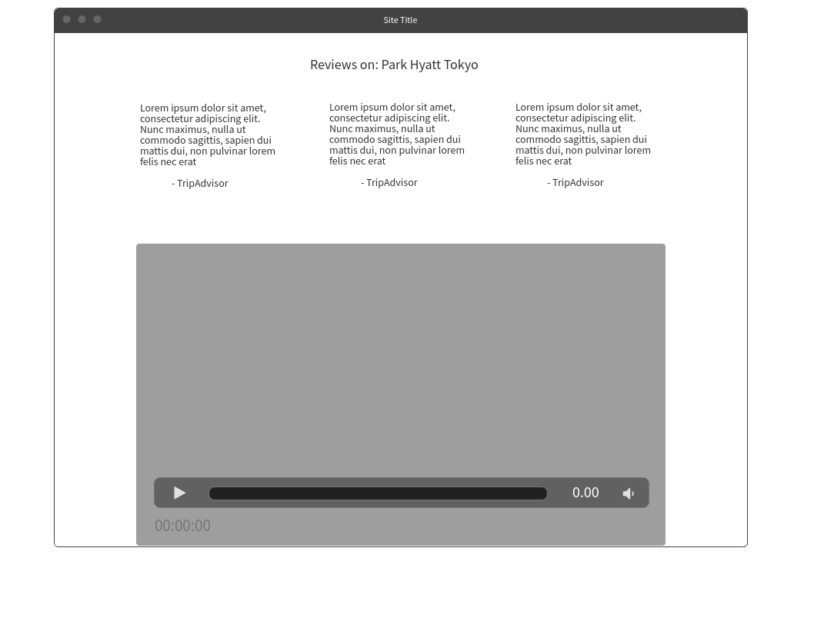

# Luxury Escapes

Table of Contents
=================

* [Overview](#overview)
* [Project details](#project-details)
    * [Core requirements](#core-requirements)
    * [Optional features](#optional-features)
* [Wireframes](#wireframes)
    * [Hero](#hero)
    * [Map & VP](#map-&-vp)
    * [Product details](#product-details)
* [Notes](#notes)
    * [Documentation & Helpful resources](#documentation-&-helpful-resources)
    * [Tools](#tools)
    * [Future](#future)

# Overview
To create a web page with a map showing pins for each offer on the first page of <a href="https://luxuryescapes.com/au" target="_blank">Luxury Escapes</a>.

Luxury Escapes public <a href="https://api.luxgroup.com/api/public-offers" target="_blank">API</a> was used.

# Project details
## Core requirements
1. Luxury Escapes Public API to get the first page of offers displayed on <a href="https://luxuryescapes.com/au" target="_blank">Luxury Escapes</a>.
2. Plot locations of each offer on a map (Google or otherwise)

## Optional features
* Next/Previous paging buttons

# Wireframes
Inspiration and designs were taken from <a href="https://luxuryescapes.com/au" target="_blank">Luxury Escapes</a>. I also included/changed some designs.

## Hero
This is the first section of the website that the user will see. The background will be an image associated with the destination. 

The underlined text (i.e. Tokyo) will change at a certain frequency. With the change in text, it will change the background.

## Map & VP
This section contains two parts:
1. The map feature - plot locations of each offer will be present. You can click on the pin and the associated information will be shown.
2. Value proposition - The main value offered (short, clear, and concise) will be shown alongside the map.

There are two designs that I have drafted. 

## Product details
This section contains more and specific details regarding the offer. 

# Notes
## Documentation & helpful resources
"If I have seen further it is by standing on the shoulders of Giants."

This project could not have been done just by myself. These links were particularly helpful. More were used.
* <a href="https://developer.mozilla.org/bm/docs/Web/JavaScript" target="_blank">MDN | JavaScript documentation</a>
* <a href="https://developers.google.com/maps/documentation/javascript/tutorial" target="_blank">Google Maps | JavaScript tutorial</a>
* <a href="https://developers.google.com/maps/documentation/javascript/adding-a-google-map" target="_blank">Google Maps | How to add a map</a>
* <a href="https://developers.google.com/maps/documentation/javascript/examples/infowindow-simple" target="_blank">Google Maps | InfoWindow</a>
* <a href="https://developer.mozilla.org/en-US/docs/Web/API/Fetch_API/Using_Fetch" target="_blank">MDN | Fetch</a>
* <a href="https://developer.mozilla.org/en-US/docs/Web/JavaScript/Reference/Global_Objects/String/indexOf" target="_blank">MDN | indexOf</a>
* <a href="https://stackoverflow.com/questions/3583724/how-do-i-add-a-delay-in-a-javascript-loop" target="_blank">Stack Overflow | Loop</a>

## Tools
Trello was used a tool for project management.

One snapshot:

## Future
Some key items that I would like to work on for the future.

* Make code more efficient and DRY.
* Incorporate the "next" and "back" feature for going through each offer.
* Google Maps: 
    * Make the experience more enjoyable and actionable using the markers.
* Hero section:
    * Clicking the text and/or button will load the displayed offer.